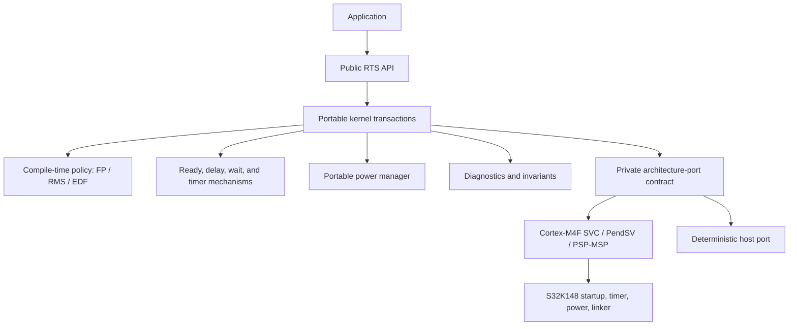
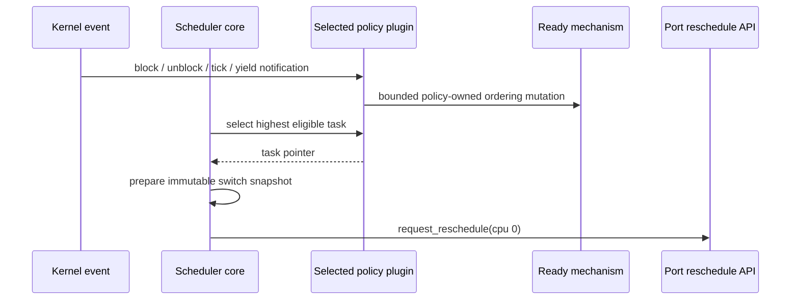
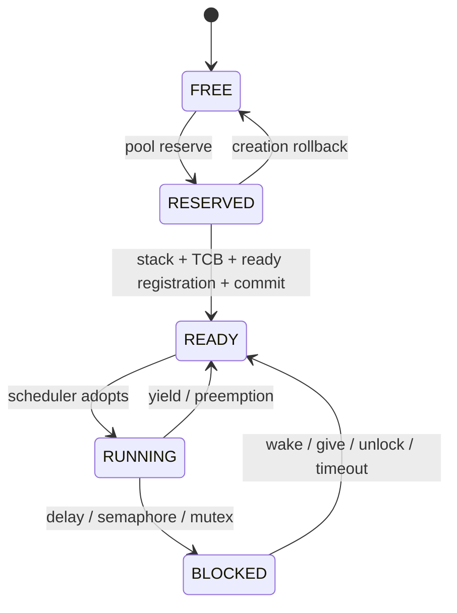
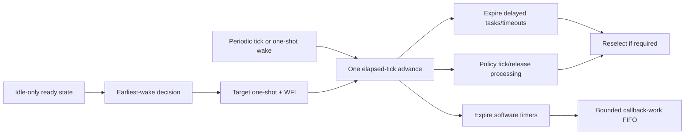
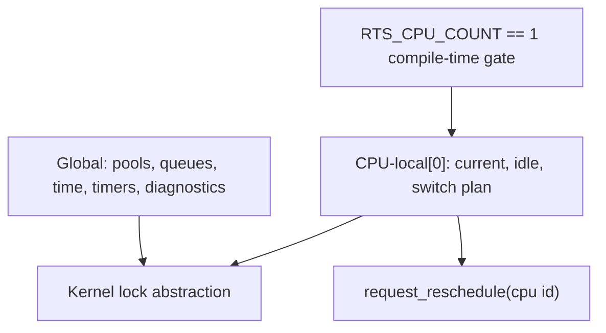

# Sprint 13 Final Architecture and Release Acceptance Review

## Decision

The v1.0.0 software baseline is internally consistent, statically bounded,
policy-pluggable at compile time, and structurally prepared for later SMP
research without implementing SMP behavior. Public/private boundaries, CPU
local ownership, the portable lock boundary, and the reschedule interface have
been reviewed and corrected.

Physical S32K148 execution evidence was not available in the review environment.
Accordingly, this gate accepts the software release candidate but does not
claim completed target validation, hardware WCET, or low-power measurements.

## Final module architecture



Dependency direction is downward only. Public headers do not include private
kernel or port headers. The portable kernel contains no S32K148/CMSIS device
dependency and does not manipulate MCU registers.

## Scheduler and policy boundary



The scheduler core does not branch on FP, RMS, or EDF selection. Exactly one
policy is selected by configuration. Runtime policy switching is rejected.
The running task remains represented according to the accepted policy contract,
and the port never chooses a task.

## Task and wait-state model



Allocated task slots never return to FREE because v1.0.0 has no task deletion.
The idle and timer-service tasks are kernel-private and do not consume
application pool slots. Wait ownership, timeout-node ownership, ready-node
ownership, and task-state transitions remain separated.

## Tick, timers, and tickless idle



Elapsed time is coalesced; the kernel does not replay suppressed interrupts.
The target reports elapsed ticks and wake source. Wrap-safe comparisons retain
the approved half-range rule.

## Cortex-M4F execution boundary

```mermaid
sequenceDiagram
    participant TaskA as Task A on PSP
    participant HW as Exception hardware on MSP
    participant PSV as PendSV
    participant Snap as Immutable switch snapshot
    participant TaskB as Task B on PSP
    TaskA->>HW: PendSV exception entry; basic frame stacked
    HW->>PSV: handler on MSP
    PSV->>PSV: save A R4-R11; store A saved SP
    PSV->>Snap: acquire A to B
    Snap-->>PSV: B saved SP
    PSV->>PSV: restore B R4-R11; set PSP
    PSV->>Snap: complete ownership transition
    PSV->>TaskB: basic-frame exception return
```

The saved stack pointer remains the first TCB field and is protected by a
compile-time offset assertion. EXC_RETURN is synthesized, not stored per task.
FPU context is deliberately unsupported and soft-float kernel/port compilation
is required.

## SMP preparation result



Completed preparation:

- `RTS_CPU_COUNT` is required and values other than one fail compilation;
- CPU identity and CPU-local accessors make current-task ownership explicit;
- current task, idle task, and switch plan form one CPU-local state group;
- portable code uses the kernel-lock wrapper instead of direct port critical
  primitives;
- reschedule requests carry a CPU identity;
- the SMP architecture document defines lock domains, IPI/memory-order needs,
  migration questions, and global-versus-local ownership.

No spinlock, IPI, migration, affinity field, remote wakeup, per-CPU ready queue,
or concurrent scheduler execution was added. The single-core fast path remains
the only executable behavior.

## Public API and ABI freeze

The public API remains under `include/rts/`; opaque handles remain incomplete
pointers and no private TCB layout is exposed. `rts_version.h` defines semantic
version 1.0.0. The detailed inventory and compatibility classification are in
`docs/release/public-api-compatibility.md`.

Private ABI checks confirmed the ARM saved-SP offset contract. The private ARM
layout for the selected target configuration is documented in
`docs/release/benchmark-report.md`; those sizes are intentionally not public
storage guarantees.

## Verification evidence

| Gate | Result |
| --- | --- |
| Deterministic policy stress | PASS: FP/RMS/EDF, 50,000 events each |
| Focused release executables available in this run | PASS: 17/17 after fixture correction |
| Strict portable Clang C11 syntax matrix | PASS: 222 translation units, 6 configurations |
| ARM Clang Cortex-M4F syntax matrix | PASS: 12 units, FP/RMS/EDF |
| Clang static analyzer | PASS after two null-guard corrections, 37 units |
| Heap/public-boundary/policy/handler release audit | PASS |
| Saved-SP layout assertion | PASS |
| Physical S32K148 startup/switch/tick/power test | NOT RUN: board unavailable |
| Hardware timing, power, and stack high-water benchmark | NOT RUN: board unavailable |
| GCC/Arm GNU CI matrix | DEFINED, not executed locally |
| Doxygen generation | DEFINED, not executed locally |

The local Windows environment lacked a system CRT/SDK and CMake's normal
compiler-probe child process stalled. Host executables were therefore built
with the repository's optional freestanding test runtime; the generated tests
were executed directly. CI retains normal GCC/Clang Debug and Release jobs.

## Static and coding-rule review

The release audit found no dynamic-allocation calls in production sources, no
private include leakage into public headers, no legacy context-switch request
symbol, and no scheduling-policy selection in the scheduler core. The scoped
MISRA/CERT review is recorded in `docs/release/misra-cert-review.md`. This is a
review aid, not compliance or certification evidence.

## Corrections made during the gate

- grouped execution ownership into an explicit CPU-local state;
- routed portable current-task access through scheduler-owned CPU accessors;
- introduced a kernel-lock boundary while preserving interrupt token semantics;
- replaced the context-switch notification with CPU-addressable rescheduling;
- added configuration rejection for CPU counts above one;
- corrected focused CMake source ownership for power tests;
- corrected test-only Cortex/host reschedule symbol ownership;
- corrected the stack-validation fixture to include enabled guard bytes;
- corrected the release audit's C-language SysTick handler recognition;
- added deterministic cross-policy stress and SMP boundary tests.

## Known limitations and blockers

The exhaustive limitation list is maintained in
`docs/release/known-limitations.md`. Release-relevant blockers are:

1. physical S32K148 startup, SVC, PendSV, SysTick, tickless, and policy images
   require execution and archived evidence;
2. hardware WCET, interrupt latency, power, and stack high-water values are not
   measured;
3. FPU context, MPU, SMP, task deletion, dynamic allocation, runtime policy
   changes, and production certification remain outside v1.0.0;
4. EDF plus mutex priority inheritance remains subject to the documented
   Version 1 policy limitation.

## Release checklist

- [x] semantic version and release notes;
- [x] public API compatibility inventory;
- [x] third-party dependency notice;
- [x] user, kernel, porting, policy, testing, and target guides;
- [x] CI/static-analysis definitions;
- [x] deterministic policy stress;
- [x] memory/stack and complexity report;
- [x] SMP preparation architecture;
- [x] source release audit;
- [ ] physical target evidence bundle;
- [ ] hardware timing/power/stack benchmark;
- [ ] promote `v1.0.0-rc1` to final `v1.0.0` tag.

## Final acceptance decision

Sprint 13 CONDITIONALLY ACCEPTED — Software release candidate complete; remaining hardware evidence documented
