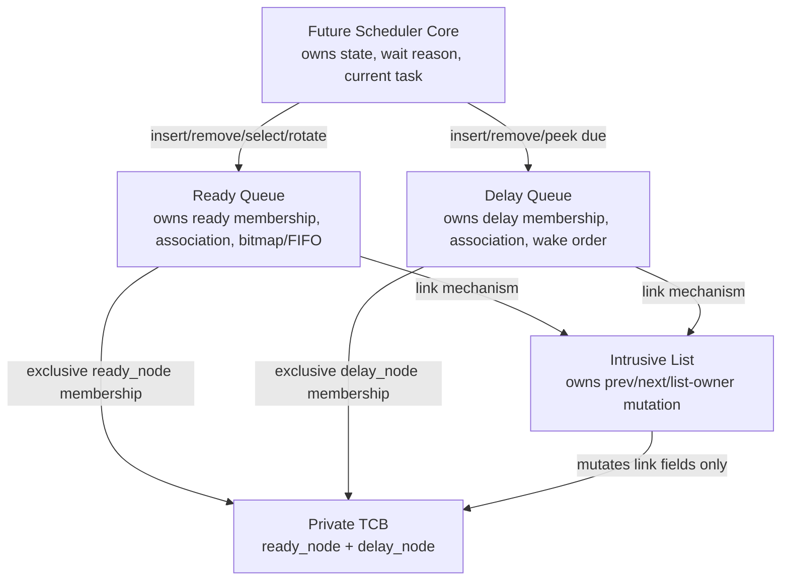

# Sprint 3 Integration Acceptance Review

**Review date:** 2026-07-14  
**Scope:** Intrusive list, fixed-priority ready set, ordered delay queue, their tests, documentation, and build integration.

## 1. Files reviewed

- `kernel/intrusive_list.h` and `kernel/intrusive_list.c`
- `kernel/ready_queue.h` and `kernel/ready_queue.c`
- `kernel/delay_queue.h` and `kernel/delay_queue.c`
- `kernel/task_internal.h`, `kernel/config_internal.h`, and `kernel/assert_internal.h`
- `tests/unit/test_intrusive_list.c`
- `tests/unit/test_ready_queue.c`
- `tests/unit/test_delay_queue.c`
- `tests/config/rts_config.h` and `tests/config_release/rts_config.h`
- top-level and test `CMakeLists.txt`
- all three Sprint 3 implementation documents
- Sprint 0, Sprint 2 internal baseline, and Sprint 2 acceptance report

The modules were reviewed as one scheduler-foundation subsystem, including the complete intended transition from ready membership to delayed membership and back.

## 2. Architecture findings

### Blocking finding corrected

Ready and delay lookup originally recovered the containing TCB by subtracting `offsetof` from a pointer to a non-initial structure member. This is a widespread systems-C idiom, but strict ISO C11 does not provide an unambiguous object-boundary/provenance guarantee for moving a pointer outside the member subobject in that manner. Keeping it would conflict with the project's no-undefined-behavior requirement.

`rts_list_node_t` now contains an opaque `void *object` backlink:

- node initialization clears it;
- intrusive insertion/removal does not interpret or modify it;
- ready insertion associates it with the exact TCB and ready removal clears it;
- delay insertion associates it with the exact TCB and delay removal clears it;
- lookup converts the stored `void *` back to the same object-pointer type and verifies the corresponding node address.

This is a conforming object-pointer round trip and keeps the intrusive layer task-agnostic. It adds one pointer per intrusive node, increasing the two-node TCB by 8 bytes on 32-bit ARM and 16 bytes on a typical 64-bit host. The current assertion-enabled TCB measures 72 bytes on ARM and 128 bytes on host; saved SP remains at offset zero.

### Other findings

- No lifecycle, current-task, state-transition, port, exception, or hardware dependency leaked into a Sprint 3 module.
- No queue operation changes task state, wait reason, scheduling decision, time slice, or saved context.
- The delay implementation correctly uses `task->wait.wake_tick`; it never reads the adjacent wait reason.
- Priority zero remains mechanically supported for idle, while enforcing idle exclusivity remains a scheduler responsibility.
- Assertions detect contract violations, but valid mutation correctness and safe guard exits do not depend on assertions being enabled.
- No additional queue API or runtime policy abstraction is required before Sprint 4.

## 3. Corrections applied

1. Added the generic opaque object backlink to `rts_list_node_t`.
2. Removed both non-initial-member container calculations.
3. Added association validation and clearing in ready and delay operations.
4. Extended tests to validate association presence, clearing, and generic list preservation.
5. Updated Sprint 2 and Sprint 3 documentation and TCB size estimates.

No scheduler behavior, task management, port behavior, timer handling, or public API was added.

## 4. Layer isolation and ownership

| Module | May know | Sole mutation responsibility | Explicitly absent |
|---|---|---|---|
| Intrusive list | Node links, list endpoints/count, opaque association storage | `previous`, `next`, and list `owner`; clears `object` only during fresh node initialization | Tasks, priority, wake time, scheduler, port |
| Ready queue | TCB priority, ready node, per-priority FIFO, bitmap | Ready-node association and membership through intrusive operations; bitmap | Task state/wait, current task, preemption, tick, port |
| Delay queue | Wake tick, delay node, ordered list | Delay-node association and membership through intrusive operations | Priority, task state/wait reason, ready node, global tick, port |
| Future scheduler | States, wait reason, current task, orchestration | State transitions and cross-queue sequence | Direct link mutation |

“Ready queue owns `ready_node`” and “delay queue owns `delay_node`” mean they alone authorize membership changes; the generic list performs the actual link-field mutation. No other module writes `previous`, `next`, or list `owner`.

## 5. Complexity summary

| Operation group | Complexity | Review result |
|---|---:|---|
| List initialize, queries, known-position insert/remove | O(1) | PASS; no traversal |
| Ready insert, remove, contains, peer, rotate | O(1) | PASS |
| Ready initialization | O(`RTS_PRIORITY_COUNT`) once | PASS; compile-time bounded |
| Highest-ready lookup | O(`ceil(priority_count/32) + 32`) | PASS; at most 8 words plus 32 bits |
| Delay initialize, remove, contains, due-head lookup | O(1) | PASS |
| Delay ordered insertion | O(n), `n <= RTS_MAX_TASKS` | PASS; sole production list traversal |
| Drain simultaneous expirations | O(k) via repeated peek/remove | Scheduler-owned future loop; `k` equals tasks due now |

Production invariant checks inspect endpoints and local neighbors only. Full traversal appears only in delay insertion and test validators.

## 6. C11 correctness

- No dynamic allocation, compiler packing, flexible/zero-length arrays, `typeof`, statement expression, or compiler-specific alias annotation is used.
- The only remaining `offsetof` use verifies saved-SP offset zero at compile time; it performs no pointer arithmetic.
- TCB lookup uses an exact object pointer stored in/recovered from `void *`, which C11 supports.
- All objects are naturally aligned typed objects; no effective-type overlay exists.
- List arithmetic is pointer assignment/comparison among actual node objects; no ordering comparison or cross-object subtraction is used.
- `count` increment and decrement are guarded against `SIZE_MAX` and zero.
- Bitmap word/bit indices are range-validated; shifts use `UINT32_C(1)` with bit positions 0–31.
- Tick subtraction is unsigned modulo arithmetic. “Due” is `(now - wake) <= INT32_MAX`; ordering rejects the exactly ambiguous `2^31` difference.
- No correctness property relies on signed overflow or implementation-defined unsigned-to-signed conversion.

## 7. Queue correctness

### Intrusive list

- Empty is `{head=NULL,tail=NULL,count=0}`.
- Unlinked linkage is `{previous=NULL,next=NULL,owner=NULL}`.
- Singleton ownership remains observable because owner is unconditional.
- Insert/remove maintain endpoints, reciprocal local links, count, and canonical unlink.
- Opaque association survives generic insertion/removal and is managed by the embedding queue.

### Ready set

- Exactly one FIFO exists per priority with one bitmap bit per FIFO.
- Tail insertion preserves equal-priority FIFO.
- Last removal clears its bit; non-last removal preserves it.
- Highest numeric priority wins across bitmap-word boundaries.
- Rotation changes only head-to-tail order at one priority and retains association/bitmap/count.
- Contains is O(1) and set-specific through node owner.

### Delay queue

- Insertion produces stable modular wake order; equal wakes remain FIFO.
- Head is the earliest active wake under the half-range horizon.
- Removal canonicalizes linkage and clears association.
- Due lookup never unlinks or changes task state.
- Repeated peek/remove deterministically extracts simultaneous expirations.
- Wraparound and exact-half ambiguity have explicit behavior.

## 8. Cross-module scheduler fit

The scheduler can use the structures without redesign. The exact legal orchestration is:

```text
Task initialized with both nodes unlinked
    -> scheduler sets state READY
    -> ready_insert(task)
    -> scheduler may mark selected task RUNNING (it remains ready-linked)
    -> scheduler ready_remove(task) before blocking
    -> scheduler sets wait wake tick/reason and state BLOCKED
    -> delay_insert(task)
    -> on due head: delay_remove(task)
    -> scheduler clears wait reason and sets state READY
    -> ready_insert(task)
```

The separate intrusive nodes technically permit two memberships, but the scheduler state/membership invariant forbids simultaneous ready and delay membership. Sprint 4/5 orchestration must enforce this under the kernel critical-section contract; no data-structure redesign is needed.

## 9. Layer and ownership diagram



## 10. Module dependency graph

```text
rts_config.h
    -> rts_types.h
        -> intrusive_list.h/.c
            -> task_internal.h
                -> ready_queue.h/.c
                -> delay_queue.h/.c

assert_internal.h -> each implementation only
ready_queue.c ----> intrusive_list.c
delay_queue.c ----> intrusive_list.c
```

There is no circular include, target include, CMSIS/NXP dependency, public exposure of private headers, or duplicate production declaration.

## 11. Build and verification results

The complete matrix was rebuilt after the portability correction:

| Suite | Assertions enabled | Assertions disabled | Cortex-M4 enabled/disabled objects |
|---|---:|---:|---:|
| Intrusive list | 0 failures | 0 failures | PASS / PASS |
| Ready queue | 0 failures | 0 failures | PASS / PASS |
| Delay queue | 0 failures | 0 failures | PASS / PASS |

All compilation used C11, `-Wall -Wextra -Werror`. Tests ran as freestanding WebAssembly through Node because this environment lacks CMake and a Windows host C runtime. The normal CMake/CTest targets are committed and use one consistent selected test configuration. Each header and production source remains portable to the ARM translation-unit build.

Measured assertion-enabled layouts after correction:

- Cortex-M4/ARM EABI: list node 16 bytes, TCB 72 bytes, alignment 4.
- Typical 64-bit host: list node 32 bytes, TCB 128 bytes, alignment 8.

## 12. Remaining non-blocking risks

- Delay insertion has bounded O(n) WCET that must be measured on S32K148.
- Portable highest-bit scanning is deterministic but may later be optimized after measurement without changing semantics.
- The object backlink costs two pointers per TCB; this is documented and included in the RAM budget.
- Host WebAssembly tests cannot model interrupt tail chaining or concurrent ISR access; those concerns belong to later scheduler/target tests.
- The final product CMake composition still needs the planned one-config-per-image identity guard when Sprint 4 adds kernel targets. Current tests explicitly share one configuration.

None requires a data-structure API or representation redesign.

## 13. Required Sprint 4 assumptions

1. TCB initialization calls `rts_list_node_initialize` for both nodes.
2. Task priority becomes immutable before first ready insertion.
3. Caller-owned stack and port-produced saved SP are validated before publication.
4. Pool reservation precedes initialization; commit to `ALLOCATED` and handle publication occur only after successful ready insertion.
5. All queue/state transactions execute under the private kernel critical contract once concurrency is possible.
6. Scheduler code changes state/wait metadata; it never writes list links, bitmap, count, owner, or object association directly.
7. Blocking removes ready membership before adding delay membership.
8. Wakeup removes delay membership before adding ready membership.
9. Production assertion failure does not return; safe guards remain defensive and deterministic if assertions are disabled.
10. All objects in one final image use exactly one selected `rts_config.h`.

Sprint 4 may implement the task pool, typed TCB allocation, task initialization, architecture stack initialization contract, task registration, and ready insertion using the existing structures.

## 14. Acceptance checklist

| Criterion | Result |
|---|---|
| All Sprint 3 artifacts reviewed together | PASS |
| Layer isolation | PASS |
| Unique link/membership/state ownership | PASS |
| Required deterministic complexity | PASS |
| Strict portable C11 object model | PASS after backlink correction |
| Intrusive list invariants | PASS |
| Ready bitmap/FIFO/rotation/highest invariants | PASS |
| Delay stable order/wrap/due/extraction invariants | PASS |
| Assertion-disabled correctness | PASS |
| Cross-module task lifecycle fit | PASS |
| Host and Cortex-M4 build coverage | PASS |
| Header/dependency isolation | PASS |
| Sprint 4 task-management readiness | PASS |

## Sprint 3 Acceptance Decision

Sprint 3 ACCEPTED — Ready for Sprint 4
